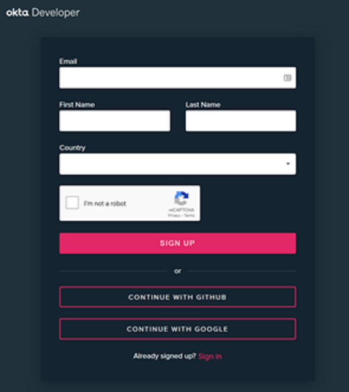

# Chapter 1: Okta Setup
### Overview
In this chapter you will set up your own Okta environment and configure Okta to provide authentication for two of the micro-services in this lab (Request Unblock & EDL Admin).

### Create Your Okta Developer Account
Okta offers free development environments, which we are going to take advantage of for this lab. This free dev environment will allow you to explore Okta features with up to 5 apps, 1000 monthly active users, and unlimited authentications.

 - [ ] Create an Okta Developer Account here: https://developer.okta.com/signup/
 - [ ] We would recommend using the `Continue with GitHub` option to create your account; it's fast and easy.

 - [ ] You will be asked by GitHub to authorize Okta to access your GitHub identity. You will also receive a confirmation email.
 - [ ] You should now be on a `Getting Started` page in the Okta Developer portal.

### Create the Admin Application
Now that you have an Okta environment, let's create some applications!

 - [ ] In the Okta Admin Portal, browse to `Applications` > `Applications` using the menu.
 - [ ] Press `+ Add Application` to create a new Okta Application.
 - [ ] As you can see on this screen, Okta has native support for many SaaS applications. Since we are integrating Okta with a custom application, we won't be using any of those templates. Press the `Create New App` button at the top right to create a custom application.
 - [ ] In the popup, select `Web` as your Platform, and `OpenID Connect` as your Sign on Method.
 - [ ] Name the Application `EDL Admin`.
 - [ ] Optionally, upload a logo for your application.
 - [ ] Add a Login redirect URI of `https://admin.edl.###.deep608lab.com/.ambassador/oauth2/redirection-endpoint` where "###" is your lab id (ex: 021 or 045). This is the domain for the `EDL Admin` micro-service.
 - [ ] A Logout redirect URI is not required.
 - [ ] Hit `Save`!

You will now see the configuration page for the `EDL Admin` application.

One last step for this application: let's assign our user account to it so we can authenticate to this app.

 - [ ] Go to the `Assignments` tab.
 - [ ] Choose `Assign`, then `Assign to People`.
 - [ ] Press `Assign` next to your account in the list.
 - [ ] You do not need to fill in any details on the form that is presented, simply press `Save and Go Back` at the bottom.
 - [ ] Hit `Done`! We are done with this application for the moment.

### Create the User Application
Now we are going to repeat the same process to create our User Application for the Request Unblock micro-service.

 - [ ] Go back to `Applications` > `Applications` and start the process over. Use these values this time:

| Field | Value |
|--|--|
| Application Name | Request Unblock |
| Login redirect URI | https://request.edl.###.deep608lab.com/.ambassador/oauth2/redirection-endpoint |

Don't forget to Assign the app to your account!

### Create Terraform Variables
The last step is to take the `Client ID` and `Client Secret` from each of the two Okta applications and save them as variables in Terraform cloud. Our Terraform configuration will pass these values along to Ambassador during our deployment; Ambassador uses them to authenticate with Okta.

 - [ ] In a new tab, log into the Terraform Cloud portal and select your `Workspace`.
 - [ ] Go to the `Variables` tab. We are going to be adding `Terraform Variables` (NOT `Environment Variables`).

We are going to add five (5) variables. You will get the value for each from the Okta Admin Portal. Using the `+ Add Variable` button, add each of these, copying and pasting from Okta. You can get these values from the Application Configuration page for each of the two apps.

| Variable Key | Variable Value |
|--|--|
| okta_domain | Example: dev-######.okta.com (same for both apps, get from either app page) |
| okta_user_app_client_id | `Client ID` field in the `Request Unblock` app |
| okta_user_app_client_secret | `Client Secret` field in the `Request Unblock` app |
| okta_admin_app_client_id | `Client ID` field in the `EDL Admin` app |
| okta_admin_app_client_secret | `Client Secret` field in the `EDL Admin` app |

Once you have those variables configured, you can continue to Chapter 2!

## Continue to [Chapter 2](chapter2.md) (Update the Block Page Container)