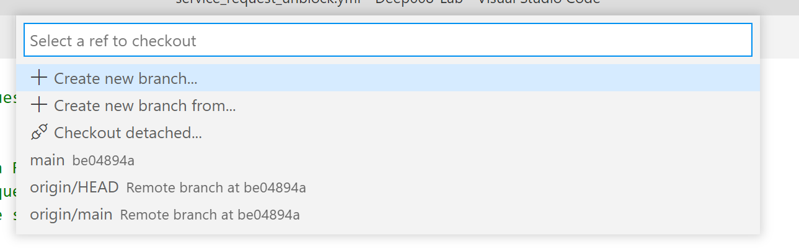
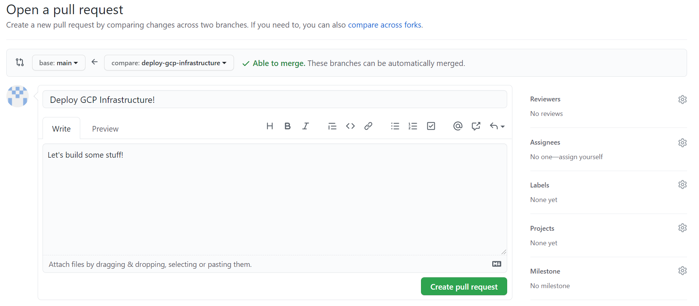

# Chapter 3: Ambassador Configuration
### Overview
In this chapter we will configure the Ambassador load balancer. Each of our four micro-services will have their own Ambassador configuration to specify things like which DNS address to use, SSL certificate provisioning, and Okta authentication. Yesterday we deployed each of our four micro-services containers to our Kubernetes cluster -- they are already running, but are not yet accessible: let's fix that.

### Start a New Branch
As we did yesterday, we are again going to create a new Git `branch` to work from. It is a best practice to avoid commiting directly to your `main` branch.

Let's get started.

 - [ ] Open your repository in VS Code.
 - [ ] Make sure the `main` branch is selected; you will see the word `main` at the very bottom left of the VS Code interface: this is the `branch` button.
 - [ ] Press on the branch button; a menu will open the top of your screen.
 
	

 - [ ] Select `+ Create new branch...` and then enter a branch name (ex: `configure-ambassador`).
 - [ ] You should now see your new branch name at the bottom left of your VS Code interface, indicating that you have switched from the `main` branch to your new branch. You can always click the branch button to open the dropdown from the previous step, which allows switching between branches in addition to creating new ones.

### Service: Block Page
First we will be configuring Ambassador for the `Block Page` micro-service. As you may recall, this micro-service simulates the web filter block page that you might see from an NGFW.

We will be working in the `service_block_page.tf` file, which already exists in your repository in the `infrastructure/` folder. The new Terraform Resources will be added to the end of the file.

 - [ ] Add an Ambassador `Host` object for this service. A Host configures a hostname, or DNS, for our micro-service to use.
```terraform
# Setup our subdomain with Ambassador and request an SSL certificate from Lets Encrypt
# https://www.getambassador.io/docs/latest/topics/running/host-crd/
resource "kubernetes_manifest" "block-page-host" {
  provider = kubernetes-alpha
  manifest = {
    "apiVersion" = "getambassador.io/v2"
    "kind"       = "Host" # This is a Host object
    "metadata" = {
      "name"      = "block-page-host" # Name of our Host object
      "namespace" = "ambassador" # Kubernetes Namespace for our Host object
    }
    "spec" = { # Specification for our Host object
      "hostname" = local.block_page_dns # Reference our Block Page DNS from our variables.tf file
      "acmeProvider" = {             # This enables SSL by using an ACME provider to generate a certificate automatically; Lets Encrypt is used by default
        "email" = local.acme_contact # Administrative contact email for the generated SSL certificate
      }
    }
  }
}
```
 
 - [ ] Add an Ambassador `Mapping` object for this service. A mapping object maps a hostname and URL path to our micro-service.
```terraform
# Create a Layer 7 route that maps our subdomain to the 'block-page' Kubernetes Service
# https://www.getambassador.io/docs/latest/topics/using/intro-mappings/
resource "kubernetes_manifest" "block-page-mapping" {
  provider = kubernetes-alpha
  manifest = {
    "apiVersion" = "getambassador.io/v2"
    "kind"       = "Mapping" # This is a Mapping object
    "metadata" = {
      "name"      = "block-page-backend" # Name of our Mapping object
      "namespace" = "ambassador" # Kubernetes Namespace for our Mapping object
    }
    "spec" = {
      "host"    = local.block_page_dns # The hostname to map; sourced from our variables.tf file
      "prefix"  = "/" # The URL path to map; in this case the root URL
      "service" = "block-page.default" # The name of the Kubernetes Service we are mapping the hostname to
    }
  }
}
```

 - [ ] Save the file. No need to commit yet, we have three more to go!

### Service: EDL
The `EDL` micro-service serves out our URL whitelist (as a plain text list) to firewalls or URL filters to use in their policy. We will configure it in the same manner as the `Block Page` service.

 - [ ] Add the Terraform Resources below to `service_edl.tf`.

<details>
  <summary>Add to service_edl.tf</summary>
  
```
# Setup our subdomain with Ambassador and request an SSL certificate from Lets Encrypt
# https://www.getambassador.io/docs/latest/topics/running/host-crd/
resource "kubernetes_manifest" "edl-host" {
  provider = kubernetes-alpha
  manifest = {
    "apiVersion" = "getambassador.io/v2"
    "kind"       = "Host"
    "metadata" = {
      "name"      = "edl-host"
      "namespace" = "ambassador"
    }
    "spec" = {
      "hostname" = local.edl_dns
      "acmeProvider" = {
        "email" = local.acme_contact
      }
    }
  }
}

# Create a Layer 7 route that maps our subdomain to the 'edl' Kubernetes Service
# https://www.getambassador.io/docs/latest/topics/using/intro-mappings/
resource "kubernetes_manifest" "edl-mapping" {
  provider = kubernetes-alpha
  manifest = {
    "apiVersion" = "getambassador.io/v2"
    "kind"       = "Mapping"
    "metadata" = {
      "name"      = "edl-backend"
      "namespace" = "ambassador"
    }
    "spec" = {
      "host"       = local.edl_dns
      "prefix"     = "/"
      "service"    = "edl.default" # <Service Name>.<Namespace>
      "timeout_ms" = 30000
    }
  }
}
```
</details>

### Service: EDL Admin
The `EDL Admin` micro-service is the admin portal where we approve or deny URL unblocking requests. In addition to a `Host` and `Mapping`, we will also be configuring authentication via Okta for this micro-service!

 - [ ] First, configure the `Host` and `Mapping` as we did in the last two sections. Add the Configuration below to `service_edl_admin.tf`.

<details>
  <summary>Add to service_edl_admin.tf</summary>
  
```terraform
# Setup our subdomain with Ambassador and request an SSL certificate from Lets Encrypt
# https://www.getambassador.io/docs/latest/topics/running/host-crd/
resource "kubernetes_manifest" "edl-admin-host" {
  provider = kubernetes-alpha
  manifest = {
    "apiVersion" = "getambassador.io/v2"
    "kind"       = "Host"
    "metadata" = {
      "name"      = "edl-admin-host"
      "namespace" = "ambassador"
    }
    "spec" = {
      "hostname" = local.edl_admin_dns
      "acmeProvider" = {
        "email" = local.acme_contact
      }
    }
  }
}

# Create a Layer 7 route that maps our subdomain to the 'edl-admin' Kubernetes Service
# https://www.getambassador.io/docs/latest/topics/using/intro-mappings/
resource "kubernetes_manifest" "edl-admin-mapping" {
  provider = kubernetes-alpha
  manifest = {
    "apiVersion" = "getambassador.io/v2"
    "kind"       = "Mapping"
    "metadata" = {
      "name"      = "edl-admin-backend"
      "namespace" = "ambassador"
    }
    "spec" = {
      "host"       = local.edl_admin_dns
      "prefix"     = "/"
      "service"    = "edl-admin.default" # <Service Name>.<Namespace>
      "timeout_ms" = 30000
    }
  }
}
```
</details>

Now we are going to configure integration with Okta! There are two additional Ambassador Objects required to configure this integration. The first is a `Filter`, which defines the configuration details to authenticate to Okta, including the `Client ID` and `Client Secret` we configured in Chapter 1. The second is a `Filter Policy`, which is used to map the `Filter` to the hostnames/paths that we want to enforce authentication for.

 - [ ] Add the `Filter` and `Filter Policy` objects to the end of `service_edl_admin.tf`.
```terraform
# Setup an Ambassador Filter that requires authentication via Okta
# https://www.getambassador.io/docs/latest/topics/using/filters/
# https://www.getambassador.io/docs/latest/howtos/sso/okta/
resource "kubernetes_manifest" "edl-admin-filter" {
  provider = kubernetes-alpha
  manifest = {
    "apiVersion" = "getambassador.io/v2"
    "kind"       = "Filter" # This is a Filter object
    "metadata" = {
      "name"      = "edl-admin-filter" # Name of our Filter object
      "namespace" = "ambassador" # Kubernetes Namespace for our Filter object
    }
    "spec" = { # Specification for our Filter object
      "OAuth2" = { # We will be using the OAuth2 standard to integrate with Okta
        "authorizationURL" = local.okta_auth_url # This is the Okta authentication URL, defined in our variables.tf
        "audience"         = "api://default" # Required boilerplate
        "clientID"         = var.okta_admin_app_client_id # The Okta Client ID
        "secret"           = var.okta_admin_app_client_secret # The Okta Client Secret
        "injectRequestHeaders" = [{ # We are adding the 'X-USERNAME' header so that our micro-service knows the username of the authenticated user!
          "name"  = "X-USERNAME"
          "value" = "{{ .token.Claims.sub }}"
        }]
        "protectedOrigins" = [{
          "origin" = "https://${local.edl_admin_dns}"
        }]
      }
    }
  }
}

# Map our Okta Filter to the 'edl-admin' subdomain
# https://www.getambassador.io/docs/latest/topics/using/filters/
# https://www.getambassador.io/docs/latest/howtos/sso/okta/
resource "kubernetes_manifest" "edl-admin-filter-policy" {
  provider = kubernetes-alpha
  manifest = {
    "apiVersion" = "getambassador.io/v2"
    "kind"       = "FilterPolicy" # This is a FilterPolicy object
    "metadata" = {
      "name"      = "edl-admin-filter-policy" # Name of our FilterPolicy object
      "namespace" = "ambassador" # Kubernetes Namespace for our FilterPolicy object
    }
    "spec" = { # Specification for our FilterPolicy object
      "rules" = [{
        "host" = local.edl_admin_dns # Map to our admin.edl.###.deep608lab.com hostname
        "path" = "*" # Any HTTP path
        "filters" = [{ # Attach our Filter object, defined above
          "name" = "edl-admin-filter"
          "arguments" = {
            "scope" = ["openid", "profile"]
          }
        }]
      }]
    }
  }
}
```

That's all for the `EDL Admin` micro-service!

### Service: Request Unblock
The `Request Unblock` micro-service is a web form for our users to submit their URL unblock requests. We are also putting Okta authentication in front of this app, so we can tell which user is submitting the request!

 - [ ] The configuration here is much the same as the `EDL Admin` service above. Add the Terraform Resources below to the end of the `service_request_unblock.tf` file.

<details>
  <summary>Add to service_request_unblock.tf</summary>
  
```terraform
# Setup our subdomain with Ambassador and request an SSL certificate from Lets Encrypt
# https://www.getambassador.io/docs/latest/topics/running/host-crd/
resource "kubernetes_manifest" "request-unblock-host" {
  provider = kubernetes-alpha
  manifest = {
    "apiVersion" = "getambassador.io/v2"
    "kind"       = "Host"
    "metadata" = {
      "name"      = "request-unblock-host"
      "namespace" = "ambassador"
    }
    "spec" = {
      "hostname" = local.request_unblock_dns
      "acmeProvider" = {
        "email" = local.acme_contact
      }
    }
  }
}

# Create a Layer 7 route that maps our subdomain to the 'request-unblock' Kubernetes Service
# https://www.getambassador.io/docs/latest/topics/using/intro-mappings/
resource "kubernetes_manifest" "request-unblock-mapping" {
  provider = kubernetes-alpha
  manifest = {
    "apiVersion" = "getambassador.io/v2"
    "kind"       = "Mapping"
    "metadata" = {
      "name"      = "request-unblock-backend"
      "namespace" = "ambassador"
    }
    "spec" = {
      "host"       = local.request_unblock_dns
      "prefix"     = "/"
      "service"    = "request-unblock.default" # <Service Name>.<Namespace>
      "timeout_ms" = 30000
    }
  }
}

# Setup an Ambassador Filter that requires authentication via Okta
# https://www.getambassador.io/docs/latest/topics/using/filters/
# https://www.getambassador.io/docs/latest/howtos/sso/okta/
resource "kubernetes_manifest" "request-unblock-filter" {
  provider = kubernetes-alpha
  manifest = {
    "apiVersion" = "getambassador.io/v2"
    "kind"       = "Filter"
    "metadata" = {
      "name"      = "request-unblock-filter"
      "namespace" = "ambassador"
    }
    "spec" = {
      "OAuth2" = {
        "authorizationURL" = local.okta_auth_url
        "audience"         = "api://default"
        "clientID"         = var.okta_user_app_client_id
        "secret"           = var.okta_user_app_client_secret
        "injectRequestHeaders" = [{
          "name"  = "X-USERNAME"
          "value" = "{{ .token.Claims.sub }}"
        }]
        "protectedOrigins" = [{
          "origin" = "https://${local.request_unblock_dns}"
        }]
      }
    }
  }
}

# Map our Okta Filter to the 'request-unblock' subdomain
# https://www.getambassador.io/docs/latest/topics/using/filters/
# https://www.getambassador.io/docs/latest/howtos/sso/okta/
resource "kubernetes_manifest" "request-unblock-filter-policy" {
  provider = kubernetes-alpha
  manifest = {
    "apiVersion" = "getambassador.io/v2"
    "kind"       = "FilterPolicy"
    "metadata" = {
      "name"      = "request-unblock-filter-policy"
      "namespace" = "ambassador"
    }
    "spec" = {
      "rules" = [{
        "host" = local.request_unblock_dns
        "path" = "*"
        "filters" = [{
          "name" = "request-unblock-filter"
          "arguments" = {
            "scope" = ["openid", "profile"]
          }
        }]
      }]
    }
  }
}
```
</details>

That's it for Ambassador configuration! Let's get to deployin'.

 - [ ] Save all your files.
 - [ ] Commit your changes to Git.
 - [ ] Push your commit to GitHub.

### Create a Pull Request
Now we are going to create a `pull request` to get the changes in our branch into the `main` branch. Let's switchover to the GitHub web interface.



 - [ ] Go to the `Pull requests` tab.
 - [ ] You should see a `Compare & pull request` button referencing the branch you just pushed.
 - [ ] You will be asked to provide a title and comment for your pull request. Also note that at the bottom of the page it shows you a `diff` of the changes you made: the difference between the files in your branch, and the `main` branch.
 - [ ] As with yesterday, you should again see a GitHub Actions Workflow run to do a `terraform plan` of your changes and show you what infrastructure is going to be deployed!
 - [ ] Once the `terraform plan` Workflow run completes successfully, return to your pull request. If it doesn't complete successfully, we will need to troubleshoot before proceeding further.

### Merge your Pull Request
Now we can complete our Pull Request and deploy our Ambassador configuration to our Kubernetes cluster!

 - [ ] Review the comment that has been added to your pull request by the Workflow. You can see all the details of Terraform's plan for the deployments you just configured.
 - [ ] If everything looks good... go ahead and hit `Merge pull request`! This will move your code into the `main` branch and kickoff the `Infrastructure` workflow to push the Ambassador configuration to Kubernetes.
 - [ ] You will be prompted to delete your branch -- go ahead and do so, we are done with it.
 - [ ] Now go back to the `Actions` tab and open the `Infrastructure` Workflow run that is in progress to watch Terraform do its work! If the Workflow does not complete successfully (green check), we will need to troubleshoot.

After this Workflow run completes... your app should be fully operational! Proceed to the next chapter to take it for a spin!

## Continue to [Chapter 4](chapter4.md) (Testing & Verification)