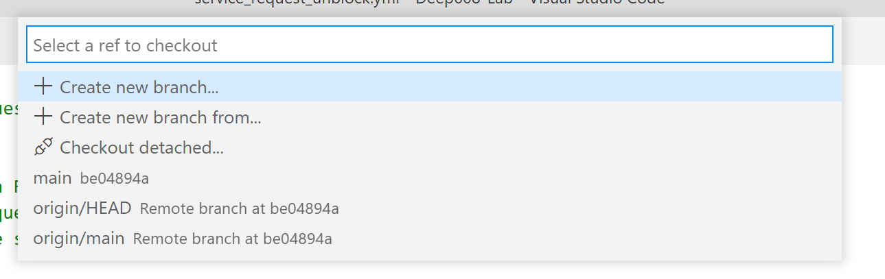

# Chapter 1: Deploy Containers
### Overview
Yesterday we used GitHub Actions (CI/CD Pipeline) and Terraform (Infrastructure-as-Code) to deploy a Kubernetes cluster to GCP. Today we are going to deploy some containers onto that cluster. Tomorrow we will configure load balancing, deploy authentication services, and test our completed micro-services app!

In this chapter we will be creating a new `branch` in `git` and using the same `pull request` workflow that we did in yesterdays lab. In our new branch we will create the Terraform configurations necessary to deploy our containers onto our Kubernetes cluster.

To recap, our micro-services application consists of 4 containers:

| Service | Description |
|--|--|
| **Block Page** | *Block Page* is a static web page hosted in an Nginx container. It simulates a URL Filtering block page that might be served by something like a NGFW. |
| **Request Unblock** | *Request Unblock* is a `Rust` app that serves a web form where users can submit requests to unblock a web page. |
| **EDL Admin** | *EDL Admin* is a `Golang` (Go) app that serves an admin panel where administrators can view unblock requests and then approve or deny them. |
| **EDL** | *EDL* is a `Python` app that serves a list of the approved URLs as plain text. This type of list can be ingested by devices such as an NGFW to be used as a whitelist during URL Filtering. |

A reminder that the source code and `Dockerfile` (instructions to Docker on how to compile our micro-services and create a container image) are all contained in the `services/` folder in the root of your repository. Feel free to take a peak!

### Verify Container Builds
Depending on how you built your environment yesterday, you may or may not have kicked off the GitHub Actions pipelines that build our container images with Docker. Let's make sure your images are built, and if not -- build them now!

 - [ ] Log into the GitHub web interface and browse to your repository.
 - [ ] Go to the `Actions` tab.
 - [ ] One at a time, select each of the four container build Workflows on the left: `Block Page`, `Request Unblock`, `EDL Admin`, and `EDL`.
 - [ ] On each Workflow, make sure there is at least one successful pipeline run (you will see a run in the list on the right with a green check mark).

If you have any Workflows that have not had a successful run, you are going to need to manually run them.

 - [ ] Open your repository in VS Code.
 - [ ] Make sure you are on the `main` branch (use the branch button at the bottom left of the VS Code interface).
 - [ ] Go to the `.github/workflows` folder.
 - [ ] For each of the `service_X.yml` files, modify them as so:
```yaml
on:
  workflow_dispatch:
  push:
```

You are adding 1 line, "workflow_dispatch:", and it should be indented to the same level as "push:". This is an additional pipeline trigger that allows you to *manually* ("dispatch") trigger your pipeline.

 - [ ] Save your files and commit your changes in VS Code.
 - [ ] Push your commit to GitHub.
 - [ ] Go back to the GitHub web interface. Browse to the `Actions` tab.
 - [ ] Select each of the four Workflows again and use the `Run workflow` button the right to manually trigger them.
 - [ ] Monitor your Workflows and make sure all four complete and have a green check mark.

Now we are ready to deploy these container images!

### Create a new Git Branch
As we did yesterday, we are again going to create a new Git `branch` to work from. It is a best practice to avoid commiting directly to your `main` branch.

Let's get started.

 - [ ] Open your repository in VS Code.
 - [ ] Make sure the `main` branch is selected; you will see the word `main` at the very bottom left of the VS Code interface: this is the `branch` button.
 - [ ] Press on the branch button; a menu will open the top of your screen.
 
	

 - [ ] Select `+ Create new branch...` and then enter a branch name (ex: `deploy-containers`).
 - [ ] You should now see your new branch name at the bottom left of your VS Code interface, indicating that you have switched from the `main` branch to your new branch. You can always click the branch button to open the dropdown from the previous step, which allows switching between branches in addition to creating new ones.

### Add the Kubernetes & Helm Providers
As a reminder from yesterday, Terraform has the concept of `provider`: an importable module that enables support for a third-party services. Today we will be using the `Kubernetes` and `Helm` providers. `Helm` is a tool that enables fast deployment of complex services on a Kubernetes cluster; we will be using it to install our Ambassador Load Balancer in the next chapter.

 - [ ] Create a new file in the `infrastructure/` folder called `kubernetes_provider.tf`.
 - [ ] Add the provider configurations from below. Note that we are using both the `kubernetes` and `kubernetes-alpha` providers. We need the alpha provider for this lab to support a Kubernetes feature (CRDs) that isn't yet supported in the standard Kubernetes provider!

For each of the three providers we are configuring here, we are providing a `host`, `token`, and `cluster_ca_certficate`.

* The `host` is the address of the Kubernetes cluster that we want Terraform to configure. In this case we use Terraform's ability to reference other parts of our Configuration to pull in the address of the Kubernetes cluster that we configured and deployed yesterday.
* The `token` is used to authenticate to the Kubernetes cluster.
* The `cluster_ca_certificate` is used to secure the connection (SSL) to the Kubernetes cluster. Note that again, we reference the Kubernetes Terraform Configuration that we made yesterday.

<details>
  <summary>kubernetes_provider.tf</summary>
  
```
# Retrieve a GCP access token (used below)
data "google_client_config" "provider" {}

# Initialize Kubernetes Terraform Provider
# This will be used to deploy our Containers
# https://registry.terraform.io/providers/hashicorp/kubernetes/latest/docs
provider "kubernetes" {
  host  = "https://${google_container_cluster.gke.endpoint}"
  token = data.google_client_config.provider.access_token
  cluster_ca_certificate = base64decode(
    google_container_cluster.gke.master_auth[0].cluster_ca_certificate,
  )
}

# Initialize the Kubernetes Alpha Terraform Provider
# This is used to apply CRDs to our Kubernetes cluster (not yet supported in main Kubernetes Provider)
# https://registry.terraform.io/providers/hashicorp/kubernetes-alpha/latest/docs
provider "kubernetes-alpha" {
  version = "0.2.0"
  host    = "https://${google_container_cluster.gke.endpoint}"
  token   = data.google_client_config.provider.access_token
  cluster_ca_certificate = base64decode(
    google_container_cluster.gke.master_auth[0].cluster_ca_certificate,
  )
}

# Initialize Helm Terraform Provider
# This is used to deploy Helm Charts to our Kubernetes cluster
# https://registry.terraform.io/providers/hashicorp/helm/latest/docs
# https://helm.sh/
provider "helm" {
  kubernetes {
    host  = "https://${google_container_cluster.gke.endpoint}"
    token = data.google_client_config.provider.access_token
    cluster_ca_certificate = base64decode(
      google_container_cluster.gke.master_auth[0].cluster_ca_certificate,
    )
  }
}
```
</details>

### Redis Configuration
Yesterday we deployed a Redis database on Google Cloud. In order for our micro-services to connect to Redis, they need connection information such as the `IP` and `Port` of the Redis instance we deployed. We are going to use a feature of Kubernetes called `Config Maps`. A Config Map allows you to store configuration data in the Kubernetes control plane and then have that configuration data automatically injected into your containers as environment variables. Our micro-service code will then read those environment variables to learn the IP and Port of Redis!

 - [ ] Add the configuration below to the end of your existing `gcp_redis.tf` file.

The `kubernetes_config_map` Terraform resource is pretty straightforward: we give it a name, and then tell it which data we want to place in the Config Map. We are again using Terraform's ability to reference other parts of our infrastructure to automatically pull in the IP (`google_redis_instance.redis.host`) and Port (`google_redis_instance.redis.port`) of the Redis instance we already created.

In the next section we will attach this Config Map to our container deployment.

<details>
  <summary>gcp_redis.tf (add)</summary>
  
```
# Store Redis Host & Port in a Kubernetes ConfigMap
# https://registry.terraform.io/providers/hashicorp/kubernetes/latest/docs/resources/config_map
# https://kubernetes.io/docs/concepts/configuration/configmap/
resource "kubernetes_config_map" "redis" {
  metadata {
    name = "redis-env"
  }
  data = {
    redis_host = google_redis_instance.redis.host
    redis_port = google_redis_instance.redis.port
  }
}
```
</details>

### Deploy Our First Container
Time to configure the deployment for our first container! For this first one, we are going to walk through the configuration in some detail; for the next three we will copy/paste (they are very similar).

 - [ ] Create a new file called `service_request_unblock.tf` in the `infrastructure/` folder. This will contain the Terraform configuration for our container deployment.

In a minute we will be adding the configuration to our new file, let's review it first. Terraform `comments` are blocks of text that are used to document the configuration, but are not executed as part of it. We have inserted several comments in the configuration below to explain the components; they are prefixed with a `#` and should be colored gray.

Here we are creating a Kubernetes `Deployment`, which is used to tell Kubernetes where to get our container, and how we want it deployed.

https://kubernetes.io/docs/concepts/workloads/controllers/deployment/

```terraform
resource "kubernetes_deployment" "request-unblock" { # Defined our Kubernetes Deployment resource
  metadata { # Configure metadata about our Kubernetes Deployment
    name = "request-unblock" # The name of the Kubernetes Deployment
    labels = {
      app = "request-unblock" # A Label for the Kubernetes Deployment; these are used to reference it later
    }
  }
  spec { # Define the Specification for our Kubernetes Deployment
    replicas = 3 # We want 3 replicas of our container to run
    selector { # A Selector is used to map this Specification to the Template below
      match_labels = {
        app = "request-unblock"
      }
    }
    template { # Define our Template; this tells Kubernetes how to get and deploy our container
      metadata { # Metadata about our container; used in the Selector above
        labels = {
          app = "request-unblock"
        }
      }
      spec { # Specification for our Container
        container {
          image = "gcr.io/${local.gcp_project}/request-unblock:latest" # This is a link to our Container in our Container Registry
          name  = "request-unblock"
          env { # Define an Environment Variable for our Container: our Redis IP
            name = "REDIS_HOST"
            value_from { # Here we reference the Config Map that we created in the last section
              config_map_key_ref {
                name = kubernetes_config_map.redis.metadata.0.name
                key  = "redis_host"
              }
            }
          }
          env { # Define an Environment Variable for our Container: our Redis Port
            name = "REDIS_PORT"
            value_from {
              config_map_key_ref { # Here we reference the Config Map that we created in the last section
                name = kubernetes_config_map.redis.metadata.0.name
                key  = "redis_port"
              }
            }
          }
          liveness_probe { # Configure a health check for our Container; this is how Kubernetes tests our Container
            http_get { # In this case we use a HTTP health check; Kubernetes makes sure it can make an HTTP request to our container
              path = "/health"
              port = 80
            }
            initial_delay_seconds = 3
            period_seconds        = 3
          }
        }
      }
    }
  }
}
```

In addition to our Kubernetes `Deployment`, we are also going to create a Kubernetes `Service`. This exposes the HTTP port on our Container.

https://kubernetes.io/docs/concepts/services-networking/service/

```terraform
resource "kubernetes_service" "request-unblock" { # Define out Kubernetes Service resource
  metadata { # Metadata about the service
    name = "request-unblock"
  }
  spec { # Specification for the Service
    selector = { # Here we are mapping it to our Deployment above.
      app = kubernetes_deployment.request-unblock.metadata.0.labels.app
    }
    session_affinity = "ClientIP"
    port { # Here we tell Kubernetes what port to use on our Container (HTTP)
      port = 80
    }
    type = "ClusterIP" # Here we specify the service type; you can read more about types in the link above
  }
}
```

 - [ ] Paste the Configuration below into your `service_request_unblock.tf` file.

<details>
  <summary>service_request_unblock.tf</summary>
  
```
# Deploy 'request-unblock' app
# https://registry.terraform.io/providers/hashicorp/kubernetes/latest/docs/resources/deployment
# https://kubernetes.io/docs/concepts/workloads/controllers/deployment/
resource "kubernetes_deployment" "request-unblock" {
  metadata {
    name = "request-unblock"
    labels = {
      app = "request-unblock"
    }
  }
  spec {
    replicas = 3
    selector {
      match_labels = {
        app = "request-unblock"
      }
    }
    template {
      metadata {
        labels = {
          app = "request-unblock"
        }
      }
      spec {
        container {
          image = "gcr.io/${local.gcp_project}/request-unblock:latest"
          name  = "request-unblock"
          env {
            name = "REDIS_HOST"
            value_from {
              config_map_key_ref {
                name = kubernetes_config_map.redis.metadata.0.name
                key  = "redis_host"
              }
            }
          }
          env {
            name = "REDIS_PORT"
            value_from {
              config_map_key_ref {
                name = kubernetes_config_map.redis.metadata.0.name
                key  = "redis_port"
              }
            }
          }
          liveness_probe {
            http_get {
              path = "/health"
              port = 80
            }
            initial_delay_seconds = 3
            period_seconds        = 3
          }
        }
      }
    }
  }
}

# Expose 'request-unblock' app as a service
# https://registry.terraform.io/providers/hashicorp/kubernetes/latest/docs/resources/service
# https://kubernetes.io/docs/concepts/services-networking/service/
resource "kubernetes_service" "request-unblock" {
  metadata {
    name = "request-unblock"
  }
  spec {
    selector = {
      app = kubernetes_deployment.request-unblock.metadata.0.labels.app
    }
    session_affinity = "ClientIP"
    port {
      port = 80
    }
    type = "ClusterIP"
  }
}
```
</details>

### Deploy the Other Containers
Now we will configure our other container deployments. They are very similar to the last, so we are not going to walk through them line-by-line; time for some copy/paste!

 - [ ] Create the 3 files below in your `infrastructure/` folder and paste the contents below into them.

<details>
  <summary>service_edl.tf</summary>
  
```
# Deploy 'edl' app
# https://registry.terraform.io/providers/hashicorp/kubernetes/latest/docs/resources/deployment
# https://kubernetes.io/docs/concepts/workloads/controllers/deployment/
resource "kubernetes_deployment" "edl" {
  metadata {
    name = "edl"
    labels = {
      app = "edl"
    }
  }
  spec {
    replicas = 3
    selector {
      match_labels = {
        app = "edl"
      }
    }
    template {
      metadata {
        labels = {
          app = "edl"
        }
      }
      spec {
        container {
          image = "gcr.io/${local.gcp_project}/edl:latest"
          name  = "edl"
          env {
            name = "REDIS_HOST"
            value_from {
              config_map_key_ref {
                name = kubernetes_config_map.redis.metadata.0.name
                key  = "redis_host"
              }
            }
          }
          env {
            name = "REDIS_PORT"
            value_from {
              config_map_key_ref {
                name = kubernetes_config_map.redis.metadata.0.name
                key  = "redis_port"
              }
            }
          }
          liveness_probe {
            http_get {
              path = "/health"
              port = 80
            }
            initial_delay_seconds = 3
            period_seconds        = 3
          }
        }
      }
    }
  }
}

# Expose 'edl' app as a service
# https://registry.terraform.io/providers/hashicorp/kubernetes/latest/docs/resources/service
# https://kubernetes.io/docs/concepts/services-networking/service/
resource "kubernetes_service" "edl" {
  metadata {
    name = "edl"
  }
  spec {
    selector = {
      app = kubernetes_deployment.edl.metadata.0.labels.app
    }
    session_affinity = "ClientIP"
    port {
      port = 80
    }
    type = "ClusterIP"
  }
}
```
</details>

<details>
  <summary>service_edl_admin.tf</summary>
  
```
# Deploy 'edl-admin' app
# https://registry.terraform.io/providers/hashicorp/kubernetes/latest/docs/resources/deployment
# https://kubernetes.io/docs/concepts/workloads/controllers/deployment/
resource "kubernetes_deployment" "edl-admin" {
  metadata {
    name = "edl-admin"
    labels = {
      app = "edl-admin"
    }
  }
  spec {
    replicas = 3
    selector {
      match_labels = {
        app = "edl-admin"
      }
    }
    template {
      metadata {
        labels = {
          app = "edl-admin"
        }
      }
      spec {
        container {
          image = "gcr.io/${local.gcp_project}/edl-admin:latest"
          name  = "edl-admin"
          env {
            name = "REDIS_HOST"
            value_from {
              config_map_key_ref {
                name = kubernetes_config_map.redis.metadata.0.name
                key  = "redis_host"
              }
            }
          }
          env {
            name = "REDIS_PORT"
            value_from {
              config_map_key_ref {
                name = kubernetes_config_map.redis.metadata.0.name
                key  = "redis_port"
              }
            }
          }
          liveness_probe {
            http_get {
              path = "/health"
              port = 80
            }
            initial_delay_seconds = 3
            period_seconds        = 3
          }
        }
      }
    }
  }
}

# Expose 'edl-admin' app as a service
# https://registry.terraform.io/providers/hashicorp/kubernetes/latest/docs/resources/service
# https://kubernetes.io/docs/concepts/services-networking/service/
resource "kubernetes_service" "edl-admin" {
  metadata {
    name = "edl-admin"
  }
  spec {
    selector = {
      app = kubernetes_deployment.edl-admin.metadata.0.labels.app
    }
    session_affinity = "ClientIP"
    port {
      port = 80
    }
    type = "ClusterIP"
  }
}
```
</details>

<details>
  <summary>service_block_page.tf</summary>
  
```
# Deploy 'block-page' app
# https://registry.terraform.io/providers/hashicorp/kubernetes/latest/docs/resources/deployment
# https://kubernetes.io/docs/concepts/workloads/controllers/deployment/
resource "kubernetes_deployment" "block-page" {
  metadata {
    name = "block-page"
    labels = {
      app = "block-page"
    }
  }
  spec {
    replicas = 3
    selector {
      match_labels = {
        app = "block-page"
      }
    }
    template {
      metadata {
        labels = {
          app = "block-page"
        }
      }
      spec {
        container {
          image = "gcr.io/${local.gcp_project}/block-page:latest"
          name  = "block-page"
          liveness_probe {
            http_get {
              path = "/"
              port = 80
            }
            initial_delay_seconds = 3
            period_seconds        = 3
          }
        }
      }
    }
  }
}

# Expose 'block-page' app as a service
# https://registry.terraform.io/providers/hashicorp/kubernetes/latest/docs/resources/service
# https://kubernetes.io/docs/concepts/services-networking/service/
resource "kubernetes_service" "block-page" {
  metadata {
    name = "block-page"
  }
  spec {
    selector = {
      app = kubernetes_deployment.block-page.metadata.0.labels.app
    }
    session_affinity = "ClientIP"
    port {
      port = 80
    }
    type = "ClusterIP"
  }
}
```
</details>

### `commit` & `push`
Let's save our changes!

 - [ ] Be sure to save all the files you edited.
 - [ ] Go to the *Git* tab in VS Code.
 - [ ] Press the `+` next to the word *Changes* to add all changed files to your commit.
 - [ ] Fill in a *commit message* in the text box near the top.
 - [ ] Press the *check* button at the top to complete your commit.
 - [ ] Push your changes. You will notice that the synchronize button now looks like a cloud with an up arrow: this is to tell you that you are pushing a new branch to GitHub (and not just changes to an existing branch).

## Continue to [Chapter 2](chapter2.md) (Deploy Ambassador)