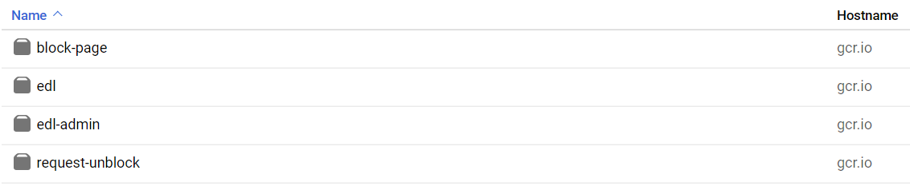
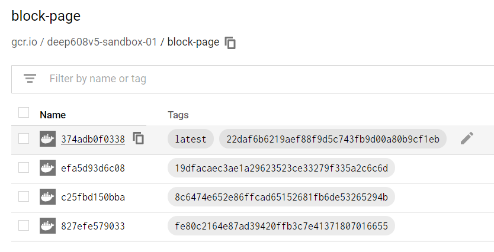

# Chapter 3: Review Deployment
### Overview
In this chapter we are going to take a moment to review the infrastructure we have deployed in the Google Cloud web interface. You will need to wait for your deployment at the end of chapter 2 to complete before proceeding.

- [ ] Log into the GCP Portal.
- [ ] You may need to select your GCP Project from the `Project Picker` at the top of the screen (immediately to the right of the `Google Cloud Platform` logo). With the `Project Picker` open, select the `ALL` tab and then click on your Lab Id.

### Container Registry
The container registry is where our container images are stored.

You can read more about Google Container Registry (GCR) here: https://cloud.google.com/container-registry

- [ ] Search for `gcr` in the search bar up top or browse to `Container Registry` in the hamburger menu.
- [ ] On the `Images` tab you will see a list of the container images you built and pushed.
	
- [ ] If you click on one of the container images, you can see a list of versions of that container in the registry, and it's associated `tags`. You can think of tags are used when pulling an image from a container registry to specify which version you want. It is common practice to have a `latest` tag that reference the newest version of the container image.
	

### GKE - Cluster
Now let's take a look at our Kubernetes Cluster!

- [ ] Search for `gke` in the search bar up top or browse to `Kubernetes Engine` in the hamburger menu.
- [ ] Start on the `Clusters` tab.
- [ ] Click on the name of your cluster to open it's details.
- [ ] On the `DETAILS` tab you can see the configuration for your Cluster.
- [ ] On the `NODES` tab you can see the nodes that make up your Cluster. Check out how much of the cluster hardware resources have been used by the containers we deployed!
- [ ] On the `STORAGE` tab you can view any persistent storage allocated to the cluster. We haven't done this yet, so there isn't anything listed!
- [ ] On the `LOGS` tab you can view your Cluster's logs!

### GKE - Workloads
Lastly, let's take a gander at the micro-services we deployed!

 - [ ] Go to the `Workloads` tab on the GKE page.
 - [ ] You should see the four `Deployments` that you created, as well as a few that the Ambassador Helm Chart created for us!
 - [ ] Go ahead and click on one of the deployment names to open its details page.
 - [ ] You will see a few things on the deployment detail page:
	* Graphs showing the CPU, Memory, and Disk usage of your running containers.
	* How many replicas of our Container (called a Pod in Kubernetes)
	* Revisions of our container image (only one right now, but if we updated our code and made a new container image, we would see more!)
	* A list of the current running instances of our Container (Pod). You will see that we have 3 copies of our Container running on 3 different Nodes!
 - [ ] Go ahead and check out the `DETAILS` and `LOGS` tabs as well!
 - [ ] The `YAML` tab shows you the internal Kubernetes YAML that represents all the configuration of this Deployment.

## Continue to [Chapter 4](chapter4.md) (Perform a Cloud Security Assessment)