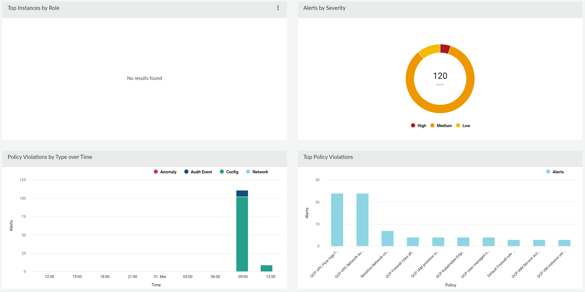
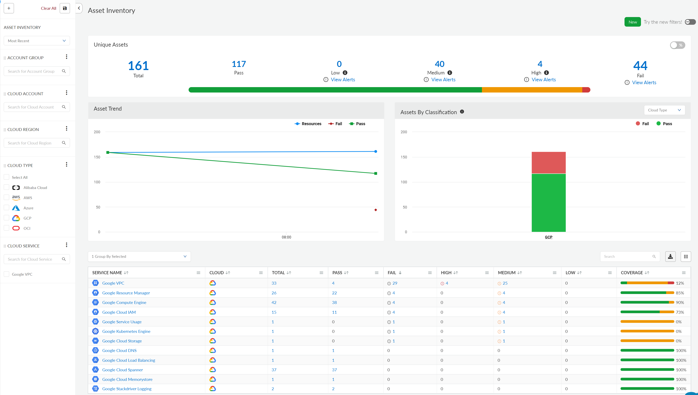
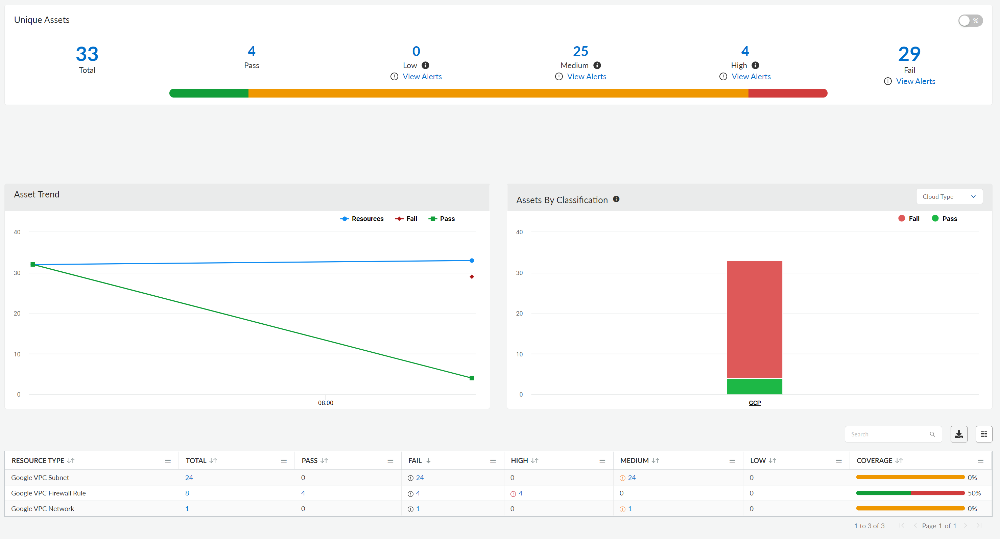
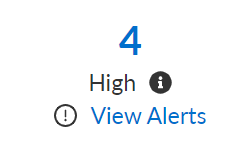
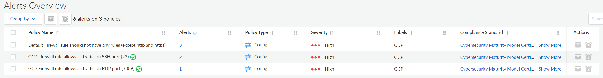
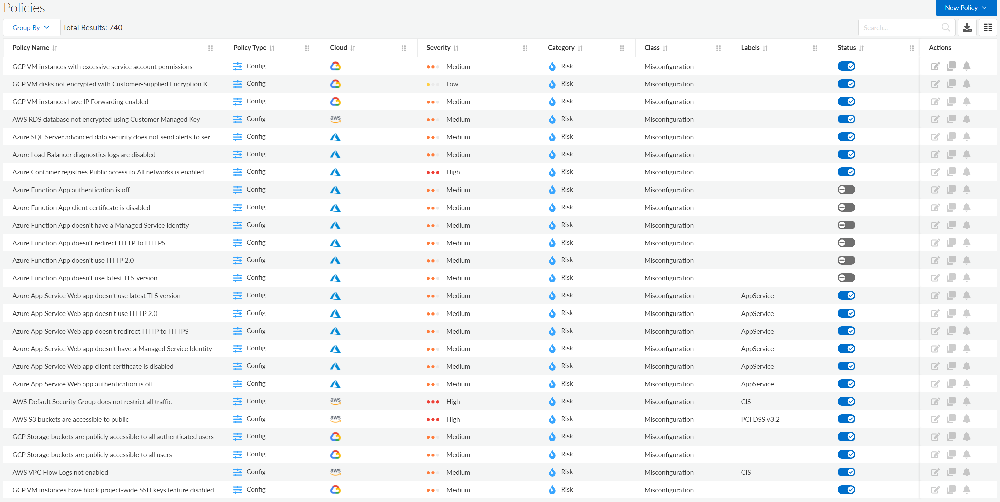
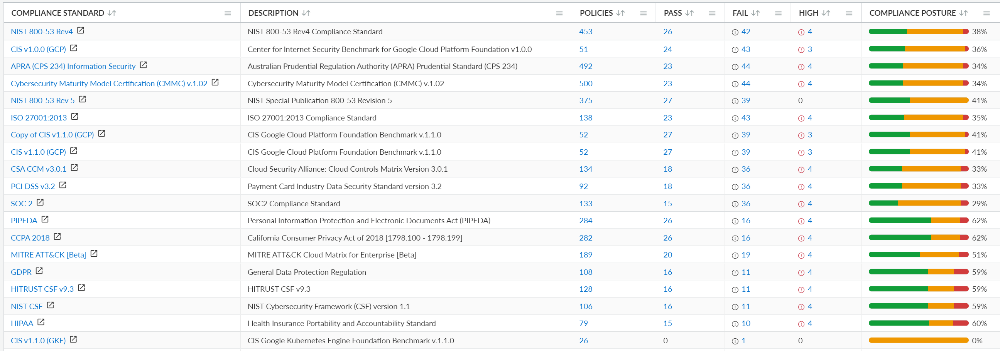
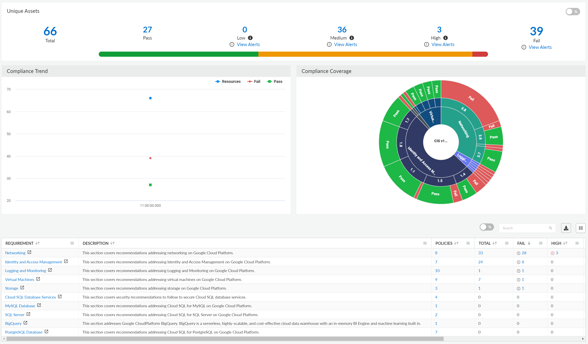
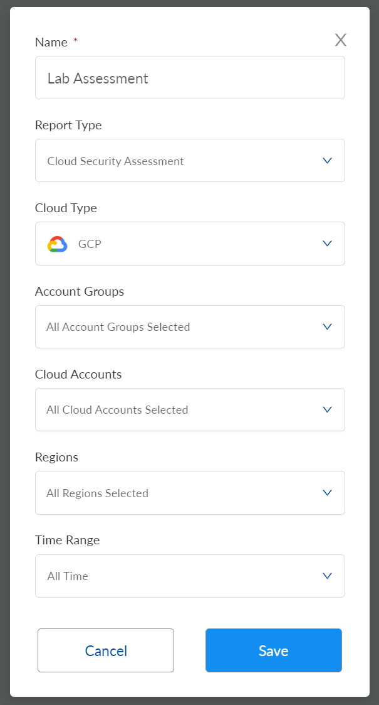
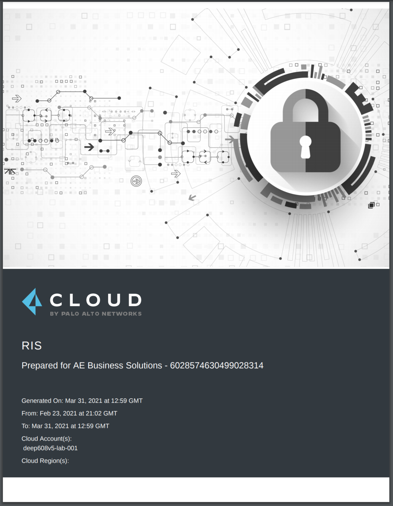

# Chapter 4: Perform a Cloud Security Assessment
### Overview
In this chapter we are going to leverage Palo Alto Network's Prisma Cloud platform to do a quick cloud security assessment. Let's get started.

 - [ ] Log into the Okta portal with your lab credentials: https://aebs.okta.com/
 - [ ] Select the Prisma Cloud app to log into Prisma Cloud.
 
 We are going to walk you through getting some useful information out of the Prisma Cloud portal below, but note that this is a fully functional Prisma Cloud account -- you are welcome to explore the entire platform.

### Dashboard
You will see the dashboard when you first log in, it will show you the overall security health of your cloud environment.

### Assets
Now let's head over to the `Assets` view. Prisma Cloud can give you a single-pane-of glass view of all your cloud assets, including assets in multiple clouds (AWS, Azure, GCP) and/or multiple accounts on those cloud.

 - [ ] Choose `Inventory` > `Assets` from the menu on the left.

Let's take a closer look

 - [ ] In the list at the bottom, click the `Google VPC` link. This will take us to a detailed view of our VPCs (Virtual Networks).

Here we can see some detail on our VPCs: how many we have, security issues that have been discovered, and the sub-resources that make up those VPCs such as subnets and firewall rules.

 - [ ] Click on the `View Alerts` link under the `High` priority alerts heading.
 
 

Now we can see the high priority alerts that have been generated for our VPC. Looks like we left SSH and RDP exposed to the internet! Oops.

### Policies
Now let's take a quick peek at `Policies`. Policies are the foundation of Prisma Cloud's compliance and alerting features. Each policy monitors for a specific misconfiguration or security issue. Feel free to browse through the built-in policies, there are hundreds of them!

 - [ ] Go to `Policies` on the menu on the left.

### Compliance
The compliance features are used to map the policies and alerts in Prisma Cloud to compliance frameworks.

 - [ ] Go to `Compliance` > `Overview` in the menu on the left.

As you can see, Prisma Cloud has mapped all of our cloud data and alerts against many compliance frameworks. Let's zoom in a bit.

 - [ ] Click into the `CIS v1.1.0 (GCP)` compliance framework from the list.

Now we are seeing a detailed breakdown of your lab environment mapped against the CIS framework. You can drill into the links in the table below to get even more detail.

### Creating a Cloud Security Assessment
Let's create a cloud security assessment! This assessment gives a summary of the security posture of your lab environment as well as specific details for all the security issues that have been identified.

 - [ ] Go to `Alerts` > `Reports` in the menu on the left.
 - [ ] Press the `+ Add New` button.
 - [ ] Fill in the form like so:

 - [ ] After a few moments, your report will be generated. Hit the download button to download the PDF.
 - [ ] Take a moment to browse the report.

## Continue to [Chapter 5](chapter5.md) (Scan our Terraform Configurations)
